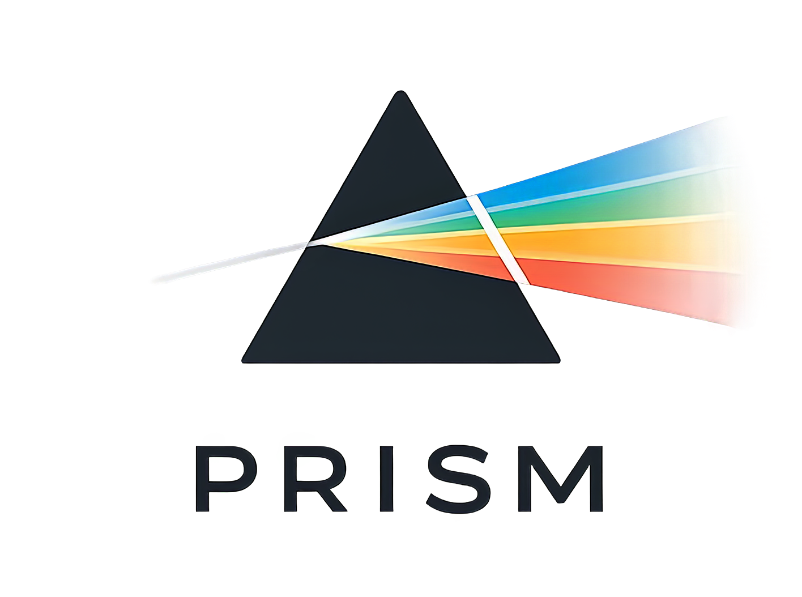

<p align=center> </p>

<h1 align="center">
Speedup Volume Understanding with Efficient Multimodal Large Language Models</h1>

<b><p align=center> <a href='https://arxiv.org/pdf/2406.07966'></a>
 </p></b>

## 📌 Overview
> ⚙️ This repository is a work in progress.

Real-world image dehazing (RID) aims to remove haze induced degradation from real scenes. This task remains challenging due to non-uniform haze distribution, spatially varying illumination from multiple light sources, and the scarcity of paired real hazy-clean data. In PRISM, we propose Proximal Scattered Atmosphere Reconstruction (PSAR), a physically structured framework that jointly reconstructs the clear scene and scattering variables under the atmospheric scattering model, thereby improving reliability in complex regions and mixed-light conditions. To bridge the synthetic-to-real gap, we design an online non-uniform haze synthesis pipeline and a Selective Self-distillation Adaptation scheme for unpaired real-world scenarios, which enables the model to selectively learn from high-quality perceptual targets while leveraging its intrinsic scattering understanding to audit residual haze and guide self-refinement. Extensive experiments on real-world benchmarks demonstrate that PRISM achieves state-of-the-art performance on RID tasks.


## 🔥 News

- **2026-04-09:** We release the arXiv version of PRISM and initialize this repository.


## 📎 Citation

If you find the code helpful in your research or work, please cite the following paper(s).

```
@article{fang2026prism,
  title={PRISM: Rethinking Scattered Atmosphere Reconstruction as a Unified Understanding and Generation Model for Real-world Dehazing}, 
  author={Chengyu Fang and Chunming He and Yuelin Zhang and Chubin Chen and Chenyang Zhu and Longxiang Tang and Xiu Li},
  journal={arXiv preprint arXiv:2604.07048},
  year={2026}
}
```


## 💡 Acknowledgements
The codes are based on [BasicSR](https://github.com/XPixelGroup/BasicSR). Please also follow their licenses. Thanks for their awesome works.
